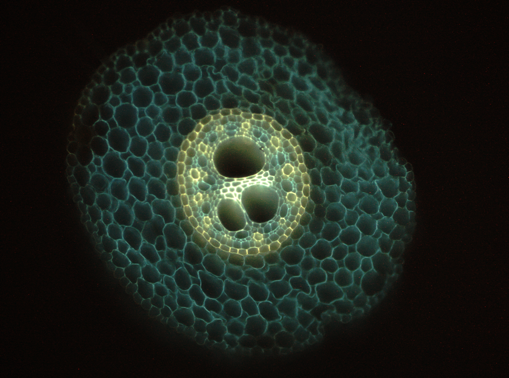

  
```{r setup, include=FALSE}
knitr::opts_chunk$set(echo = TRUE)
setwd("~/GitHub/B73_HydraulicMap")

```

## Protocol to get the hydraulic conductivities along the root axes of maize root.

The results of coupling GRANAR with MECHA is the estimation of the hydraulic conductivities of a root.
GRANAR will generate root cross section anatomy. MECHA will use the synthetic root cross section to calculate the radial conductivities (Kr) and the axial conductance (Kx).

To access the information needed to run GRANAR, it requires free-hand section or permanent root cross section.
Staining the cross section will allow to spot the different apoplastic barriers.

In this example, free-hand section were stain with aqueouse solution of berberin (1h) and post-stain with analine blue (30min).




```{r depedencies, eval=T, message=FALSE, echo=T, warning=F}

# Dependencies

library(tidyverse)
library(cowplot)
library(readxl)
library(plyr)
library(deldir)
library(alphahull)
library(sp)
library(xml2)
library(GGally)
# List of function from the GRANAR packages that have been slighly modified and functions for this script 
source("R/granar.R")
`%!in%` <- compose(`!`, `%in%`)
```

Loading experimental data

```{r, warning=F, message=F}
root_name <- c("SBR", "Tap", "Basal", "LAT", "LAT_A")

Data_params <- read_excel("Data_params.xlsx")%>%
  as.tibble()
Data_params$cell[Data_params$Root_id == "05_01" & Data_params$tissue == "xylem" & !is.na(Data_params$cell)] <- Data_params$cell[Data_params$Root_id == "05_01" & Data_params$tissue == "xylem" & !is.na(Data_params$cell)]*2
params <- read_param_xml("www/Zea_mays_B73_S_01.xml")

# number of time the generation of anatomies will be replicated.
n_rep <- 2 # always >1

```
The anatomical features ploted against the distance to the tip

We observed that many of them follow a linear regression.

```{r, warning=F, message=F}
Data_params%>%
  filter(tissue %!in% c("proto", "xylem"),
         !is.na(tissue),
         tissue != "aer")%>%
  ggplot(aes(dist, cell))+
  geom_point(alpha = 0.2, aes(colour = Root))+
  geom_smooth(method = "lm", aes(colour = Root))+
  facet_wrap(~tissue)+
  ylab("Cell size [um]")+
  xlab("distance from the tip [cm]")+
  viridis::scale_colour_viridis(discrete = T)

Data_params%>%
  filter(tissue %in% c("cortex"))%>%
  ggplot(aes(Root, layer))+
  geom_boxplot(aes(colour = Root))+
  facet_grid(~tissue)+
  ylab("layer width [um]")+
  xlab("distance from the tip [cm]")+
  viridis::scale_colour_viridis(discrete = T)

Data_params%>%
  filter(tissue == "xylem",
         !is.na(tissue))%>%
  ggplot(aes(dist, cell))+
  geom_point(alpha = 0.2, aes(colour = Root))+
  geom_smooth(method = "lm", aes(colour = Root))+
  facet_wrap(~tissue)+
  ylab("Cell size [um]")+
  xlab("distance from the tip [cm]")+
  viridis::scale_colour_viridis(discrete = T)

```
```{r, warning=F, message=F}

stelar <- Data_params%>%
  filter(tissue %in% c("stele"))

stelar%>%
  ggplot(aes(dist, layer))+
  geom_point(aes(colour = Root))+
  geom_smooth(aes(colour = Root), method = "lm")+
  facet_grid(~tissue)+
  viridis::scale_colour_viridis(discrete= T)

xylem <- Data_params%>%
  filter(tissue %in% c("xylem"))

xylem %>%
  ggplot(aes(dist, cell, colour = Root))+
  geom_point()+
  geom_smooth(method = "lm")+
  viridis::scale_colour_viridis(discrete= T)

xylem %>%
  ggplot(aes(dist, layer, colour = Root))+
  geom_point()+
  geom_smooth(method = "lm")+
  viridis::scale_colour_viridis(discrete= T)

cortex <- Data_params%>%
  filter(tissue %in% c("cortex"))

cortex %>%
  ggplot(aes(dist, layer, colour = Root))+
  geom_point()+
  geom_smooth(method = "lm")+
  ylab("cortex width")+
  viridis::scale_colour_viridis(discrete= T)
```

The correlation between xylem and stele

```{r, warning=F, message=F}
cor_ma_tmp <- Data_params%>%
  filter(tissue %in% c("xylem"))%>%
  dplyr::group_by(Image)%>%
  dplyr::summarise(xylem_size = mean(cell))%>%
  ungroup()
cor_ms_tmp <- Data_params%>%
  filter(tissue %in% c("stele"))%>%
  dplyr::group_by(Image)%>%
  dplyr::summarise(stele_size = mean(layer))%>%
  ungroup()

cor <- merge(cor_ma_tmp, cor_ms_tmp, by = "Image")

ggpairs(cor%>%select(-Image))
```

The location of the apoplastic barriers formation and the maturation of the metaxylem.

```{r, warning=F, message=F}
rom <- read_excel("Root_maturation.xlsx")%>%
  as.tibble()

Data_params%>%
  filter(!is.na(Xyl_m) )%>%
  ggplot()+
  geom_point(aes(dist, Xyl_m, colour = Root))+
  geom_line(aes(dist, Xyl, colour = Root), size = 1, alpha = 0.8, data = rom)+
  facet_wrap(~Root, scale = "free")+
  viridis::scale_colour_viridis(discrete= T)

Data_params%>%
  filter(!is.na(Xyl_m), Root_id != "14_01" )%>% # outliers
  ggplot()+
  geom_point(aes(dist, -Apo, colour = Root))+
  geom_line(aes(dist, -Apo, colour = Root), size = 1, alpha = 0.5, data = rom%>%filter(!is.na(Apo)))+
  facet_wrap(~Root, scale = "free")+
  viridis::scale_colour_viridis(discrete= T)
```

Gathering data for an overall view of the root cross sections.

```{r, warning=F, message=F}
# Prepare data
Data <- Data_params%>%
  dplyr::group_by(Image, tissue, dist, Root, Root_id)%>%
  dplyr::summarise(cell = mean(cell, na.rm = T),
                   layer = mean(layer, na.rm = T))%>%
  ungroup()%>%
  filter(!is.na(tissue))  

stele = CT = nX = xylem = CF <- NULL

for (im in unique(Data$Image)) {
  # Get the total diameter of the root
  
  tmp <- Data%>%
    filter(Image == im)
  if(nrow(tmp) == 8){
    
    tot <- tmp$cell[tmp$tissue == "endo"]+
      tmp$cell[tmp$tissue == "pericycle"]+
      tmp$cell[tmp$tissue == "exo"]+
      tmp$cell[tmp$tissue == "epi"]+
      tmp$layer[tmp$tissue == "stele"]/2+
      tmp$layer[tmp$tissue == "cortex"]
    
    total <- tibble(Image = im, 
                    tissue = c("total"),
                    cell = NA, 
                    layer = tot, 
                    dist = unique(tmp$dist), 
                    Root = unique(tmp$Root),
                    Root_id = unique(tmp$Root_id))
    stele <- cbind(stele, tmp$layer[tmp$tissue == "stele"]/2+tmp$cell[tmp$tissue == "endo"]+
      tmp$cell[tmp$tissue == "pericycle"])
    CF <- cbind(CF, tmp$layer[tmp$tissue == "cortex"]/tmp$cell[tmp$tissue == "cortex"])
    CT <- cbind(CT, tot)
    nX <- cbind(nX, tmp$layer[tmp$tissue == "xylem"] )
    xylem <- cbind(xylem, tmp$cell[tmp$tissue == "xylem"])
    
    Data <- rbind(Data, total)
  }
}
sct <- tibble(stele= c(stele), CT= c(CT), nX = c(nX), xylem = c(xylem), CF = c(CF))

```

correlation between xylem area and stele area under log.

```{r, echo=F, warning=F, message=F }
sct <- sct%>%
  mutate(ln_SXA = log(pi*stele^2, base = exp(1)),
         ln_XSA = log(pi*xylem^2*nX, base = exp(1)))
sct%>%
  ggplot(aes(ln_SXA,ln_XSA))+
  geom_point()+
  geom_smooth(method = 'lm')

fit <- aov(ln_XSA ~ ln_SXA, data = sct)
summary(lm(ln_XSA ~ ln_SXA, data = sct))

xyl_int <- fit$coefficients[1]
xyl_m <- fit$coefficients[2]

ggpairs(sct)

```

## GRANAR

The anatomical data can be modelled to set the GRANAR parameter.
The function Get_granarparam take the anatomical data for each root type individualy and look for a relation between the feature and the distance from the root apex. 
if p-value > 0.05, then the average value for the feature is took.


```{r granar, eval= F, echo=T, message=F}
simple <- NULL
mapp <- c(seq(0.5, 2, by = 0.25),3:15,20,30,40)
# root_name <- root_name[-1]
for (root_type in root_name){
  mapp <- c(seq(0.5, 2, by = 0.25),3:15,20,30,40)
  # Shoot Born root parameter
  param <- Get_granarparam(Data_params = Data_params%>%
                             filter(Root == root_type,
                                    tissue != "aer"))
  tiss_param <- param[[1]]
  layer_param <- param[[2]]

  # Run GRANAR on 30 cm and make 3 repetitions
  all_roots = nodes <- NULL
  for (d in mapp){
    message(paste0(">>>>> Generation of ",root_type," cross section at ",d,"cm from tip. <<<<<"))

    for(rep in c(1:n_rep)){
      print(rep)

      params <- set_params(tiss_param, layer_param, params)

      # n metaxylem vessels
      nX <- layer_param$one[layer_param$lay =="xylem"]+d*layer_param$slope[layer_param$lay =="xylem"]
      SXA <- pi*((layer_param$one[layer_param$lay =="stele"]+d*layer_param$slope[layer_param$lay =="stele"])/2)^2
      XSA <- exp(xyl_int+xyl_m*log(SXA,base = exp(1)))
      xyl_area <- XSA/nX
      # xylem size
      c_xylem <- sqrt(xyl_area/pi)
      c_stele <- tiss_param$one[tiss_param$tiss=="stele"]+d*tiss_param$slope[tiss_param$tiss =="stele"]
      params$value[params$name == "xylem" & params$type == "max_size"] <- c_xylem/1000-c_stele/1000


      sim <- create_anatomy(parameters = params)
      if (d %in% c(2, 5, 10 )){print(plot_anatomy(sim))}

      if(file.exists("MECHA_GRANAR/cellsetdata/B73/current_root.xml")){
        file.remove("MECHA_GRANAR/cellsetdata/B73/current_root.xml")
      }
      write_anatomy_xml(sim = sim, path = "MECHA_GRANAR/cellsetdata/B73/current_root.xml")

      fc <- file.copy(from = "MECHA_GRANAR/cellsetdata/B73/current_root.xml",
                        to = paste0("MECHA_GRANAR/cellsetdata/B73/",root_type,"_", d,"_",rep,".xml"),
                        overwrite = T)
      all_roots <- rbind(all_roots, sim$output%>%
                             mutate(dist = d,
                                    repet = rep))
      nodes <- rbind(nodes, sim$nodes%>%
                         mutate(dist = d,
                                repet = rep))
      }
  }
    #Save data
  write.csv(all_roots, paste0("all_roots_",root_type,".csv"))
  write.csv(nodes, paste0("nodes_",root_type,".csv"))
  
  simple <- rbind(simple, 
                  tiss_param%>%transmute (intercept = one,
                                          slope = slope,
                                          tissue = tiss,
                                          type = "cell diameter",
                                          root = root_type),
                  layer_param%>%transmute (intercept = one,
                                          slope = slope,
                                          tissue = lay,
                                          type = "layer feature",
                                          root = root_type))
  
}

write.csv(simple, "linear_params.csv")

```


```{r granar_repre, echo=F, warning=F, message=F}
all_roots_T<- read.csv("all_roots_tap.csv")
all_roots_B<- read.csv("all_roots_basal.csv")
all_roots_S<- read.csv("all_roots_SBR.csv")
all_roots_L<- read.csv("all_roots_LAT.csv")
all_roots_LA<- read.csv("all_roots_LAT_A.csv")
all_roots <- rbind(all_roots_B%>%mutate(Root = "Basal"),
                   all_roots_S%>%mutate(Root = "SBR"),
                   all_roots_T%>%mutate(Root = "Tap"),
                   all_roots_L%>%mutate(Root = "LAT"),
                   all_roots_LA%>%mutate(Root = "LAT_A"))

col_namy <- c("id_cell","x","y","type","area" ,"dist", "angle",
              "radius","id_layer","id_group","my","mx","atan",
              "x1","x2" ,"y1","y2","wall_length","repet" )
nodes_T<- read.csv("nodes_tap.csv")%>%select(col_namy)
nodes_B<- read.csv("nodes_basal.csv")%>%select(col_namy)
nodes_S<- read.csv("nodes_SBR.csv")%>%select(col_namy)
nodes_L<- read.csv("nodes_LAT.csv")%>%select(col_namy)
nodes_LA<- read.csv("nodes_LAT_A.csv")%>%select(col_namy)
nodes <- rbind(nodes_B%>%mutate(name = "Basal"),
               nodes_S%>%mutate(name = "SBR"),
               nodes_T%>%mutate(name = "Tap"),
               nodes_L%>%mutate(name = "LAT"),
               nodes_LA%>%mutate(name = "LAT_A"))

```

Summary of the GRANAR runs over the moddeled root anatomical features.

```{r granar plot, warning=F, message=F}
nodes%>%
  filter(repet == 1,
         dist %in% c(5,10,15,20),
         name %in% c("Tap", "SBR", "Basal"))%>%
  ggplot()+
  geom_segment(aes(x = x1, xend = x2, y = y1, yend = y2))+
  theme_classic()+
  coord_fixed()+
  facet_grid(name~dist)

nodes%>%
  filter(repet == 1,
         dist %in% c(1,2,5,7,10),
         name %in% c("LAT", "LAT_A"))%>%
  ggplot()+
  geom_segment(aes(x = x1, xend = x2, y = y1, yend = y2))+
  theme_classic()+
  coord_fixed()+
  facet_grid(name~dist)+
  ylim(0,0.2)

```

## Benchmark

Does the simulated cross section have similar anatomical feature as the one that were used to set the parameters.

```{r, warning=F, message=F}
diameter <- nodes%>%
  dplyr::group_by(name, dist, repet, type)%>%
  dplyr::summarise(min_x = min(x1),
                   min_y = min(y1),
                   max_x = max(x1),
                   max_y = max(y1),
                   d = ((max_x-min_x)+(max_y-min_y))/2)%>%
  ungroup()

cortex_d <- diameter%>%
  filter(type == "cortex")
endo_d <- diameter%>%
  filter(type == "endodermis")
stele_d <- diameter%>%
  filter(type == "stele")

diam <- rbind(stele_d, cortex_d)%>%
  mutate(d_cortex = c(rep(NA, nrow(stele_d)),c(cortex_d$d-endo_d$d)),
         tissue = type)

Data_params%>%
  filter(tissue %in% c("stele", "cortex"))%>%
  ggplot(aes(dist, layer))+
  geom_point(aes(colour = Root), alpha = 0.1)+
  geom_smooth(aes(colour = Root), method = "lm")+
  geom_point(aes(dist, d*1000, colour = name), data = diam%>%
               filter(tissue == "stele"), shape = 2)+
  geom_point(aes(dist, d_cortex*500, colour = name), data = diam%>%
               filter(tissue == "cortex"), shape = 2)+
  facet_wrap(~tissue)+
  labs(shape = "GRANAR")+
  viridis::scale_colour_viridis(discrete= T)
  


```

## MECHA

```{r, echo=F, warning=F, message=F}
fls_done <- list.files("./MECHA_GRANAR/Projects/GRANAR/out/M1v4/Root/")
fls_done <- fls_done[grepl(".txt", fls_done)]
fls_done <- fls_done[grepl("Macro_prop_1,0", fls_done)]
done_tmp <- unlist(str_split(fls_done, "Macro_prop_1,0_"))
done_tmp <- done_tmp[done_tmp != ""]
fls_done <- str_replace(done_tmp, ".txt", ".xml")
```

From the generated anatomies the MECHA model estimates the kr with cell hydraulic properties set in the input file.

```{r MECHA, eval = F}

fls <- list.files("./MECHA_GRANAR/cellsetdata/")
fls <- fls[grepl(".xml", fls)]
fls <- fls[fls != "current_root.xml"]

# fls <- fls[fls %!in% fls_done]

fls_done <- NULL

for(j in fls){
  print(j)
  id_root <- unlist(str_split(j, "_"))[1]
  id_dist <- unlist(str_split(j, "_"))[2]
  id_rep <- parse_number(unlist(str_split(j, "_"))[3])
  if(id_dist == "A"){
    id_root <- "LAT_A"
    id_dist <- unlist(str_split(j, "_"))[3]
    id_rep <- parse_number(unlist(str_split(j, "_"))[4])
  }
  
  if(file.exists("./MECHA_GRANAR/Projects/GRANAR/out/M1v4/Root/Project_Test/results/Macro_prop_1,0.txt")){
    file.remove("./MECHA_GRANAR/Projects/GRANAR/out/M1v4/Root/Project_Test/results/Macro_prop_1,0.txt")
    file.remove("./MECHA_GRANAR/Projects/GRANAR/out/M1v4/Root/Project_Test/results/Macro_prop_2,1.txt")
    file.remove("./MECHA_GRANAR/Projects/GRANAR/out/M1v4/Root/Project_Test/results/Macro_prop_4,2.txt")
    file.remove("./MECHA_GRANAR/cellsetdata/current_root.xml")
  }
  
  fc <- file.copy(paste0("./MECHA_GRANAR/cellsetdata/",j), "./MECHA_GRANAR/cellsetdata/current_root.xml", overwrite = T)
  if(fc){
  system("C:/Users/heymansad/AppData/Local/Continuum/anaconda3/envs/MECHA/python.exe MECHA_GRANAR/MECHAv4_light.py")
  if(file.exists("./MECHA_GRANAR/Projects/GRANAR/out/M1v4/Root/Project_Test/results/Macro_prop_1,0.txt")){
    file.copy("./MECHA_GRANAR/Projects/GRANAR/out/M1v4/Root/Project_Test/results/Macro_prop_1,0.txt",
              paste0("./MECHA_GRANAR/Projects/GRANAR/out/M1v4/Root/Macro_prop_1,0_",id_root,"_",id_dist,"_",id_rep,".txt"))
    file.copy("./MECHA_GRANAR/Projects/GRANAR/out/M1v4/Root/Project_Test/results/Macro_prop_2,1.txt",
              paste0("./MECHA_GRANAR/Projects/GRANAR/out/M1v4/Root/Macro_prop_2,1_",id_root,"_",id_dist,"_",id_rep,".txt"))
    file.copy("./MECHA_GRANAR/Projects/GRANAR/out/M1v4/Root/Project_Test/results/Macro_prop_4,2.txt",
              paste0("./MECHA_GRANAR/Projects/GRANAR/out/M1v4/Root/Macro_prop_4,2_",id_root,"_",id_dist,"_",id_rep,".txt"))
    tmp <- paste0(id_root, "_", id_dist, "_", id_rep,".xml")
    fls_done <- c(fls_done, tmp)
  }else{
    print(j)
    print("fail")
  }
  }else{break}
  
}

```


```{r, echo= F, warning=F, message=F}

read_mecha_output <- function(path1,path2,path3){
  
  K1 <- read.delim(path1)
  K2 <- read.delim(path2)
  K3 <- read.delim(path3)
  radial <- str_split(paste0(K1[4,1]), " ")[[1]]
  kr1 <- as.numeric(unlist(regmatches(radial,gregexpr("[-+]?[0-9]*\\.?[0-9]+([eE][-+]?[0-9]+)?",radial))))[1]
  radial <- str_split(paste0(K2[4,1]), " ")[[1]]
  kr2 <- as.numeric(unlist(regmatches(radial,gregexpr("[-+]?[0-9]*\\.?[0-9]+([eE][-+]?[0-9]+)?",radial))))[1]
  radial <- str_split(paste0(K3[4,1]), " ")[[1]]
  kr3 <- as.numeric(unlist(regmatches(radial,gregexpr("[-+]?[0-9]*\\.?[0-9]+([eE][-+]?[0-9]+)?",radial))))[1]
  
  Ktot <- tibble(kr1 = kr1, kr2 = kr2, kr3 = kr3)
  return(Ktot)
}


```

Loading the output of MECHA.

```{r, warning=F, message=F}
K <- NULL

for(h in fls_done){
  
  id_root <- unlist(str_split(h, "_"))[1]
  id_dist <- unlist(str_split(h, "_"))[2]
  id_rep <- parse_number(unlist(str_split(h, "_"))[3])
  if(id_dist == "A"){
    id_root <- "LAT_A"
    id_dist <- unlist(str_split(h, "_"))[3]
    id_rep <- parse_number(unlist(str_split(h, "_"))[4])
  }

  path1 <- paste0("./MECHA_GRANAR/Projects/GRANAR/out/M1v4/Root/Macro_prop_1,0_",id_root,"_",id_dist,"_",id_rep,".txt")
  path2 <- paste0("./MECHA_GRANAR/Projects/GRANAR/out/M1v4/Root/Macro_prop_2,1_",id_root,"_",id_dist,"_",id_rep,".txt")
  path3 <- paste0("./MECHA_GRANAR/Projects/GRANAR/out/M1v4/Root/Macro_prop_4,2_",id_root,"_",id_dist,"_",id_rep,".txt")
  
  tmp_K <- read_mecha_output(path1, path2, path3)
  tmp_K <- cbind(root_name = id_root, d = parse_number(id_dist), rep = id_rep, tmp_K)
  K <- rbind(K, tmp_K)
}


```

Comparison between the hydraulic conductivity curve that were generated and the ones of Doussan et al. 1998.

```{r kx, warning=F, message=F}

K_xyl_unM <- nodes%>%
  filter(type == "xylem")%>%
  dplyr::group_by(id_cell, repet, name, dist)%>%
  dplyr::summarise(a = mean(area)*1000^2, ## mm2 to um2
            k_xyl_s = a^2/(8*pi*200*1E-5/3600/24)*1E-12)%>%
  ungroup()%>%
  dplyr::group_by(repet, name, dist)%>%
  dplyr::summarise(Kx_un = sum(k_xyl_s)*200/1E4)%>%
  ungroup()%>%
  mutate(ID = paste0(name,"_",dist,"_", repet))
K_xyl_M <- nodes%>%
  filter(type %in% c("xylem", "metaxylem"))%>%
  dplyr::group_by(id_cell, repet, name, dist)%>%
  dplyr::summarise(a = mean(area)*1000^2, ## mm2 to um2
            k_xyl_s = a^2/(8*pi*200*1E-5/3600/24)*1E-12)%>%
  ungroup()%>%
  dplyr::group_by(repet, name, dist)%>%
  dplyr::summarise(kx = sum(k_xyl_s)*200/1E4)%>%
  ungroup()%>%
  mutate(ID = paste0(name,"_",dist,"_", repet))

K$ID = paste0(K$root_name,"_",K$d, "_", K$rep)

Kconduct <- left_join(K, K_xyl_unM, by = "ID")
Kconduct <- left_join(Kconduct, K_xyl_M, by = "ID")


# Load Doussan et al. 1998 Conductivities data file
conductivities <- read.csv("Doussan_conductivities.csv")
conv = 0.001157407
conv_kx = 1.157407e-09

K_axial <- NULL
for(root in c("SBR", "Tap", "Basal", "LAT", "LAT_A")){
  if (root == "SBR"){
    unM = 10
    M = 12
  }else if (root == "Basal"){
    unM = 15
    M = 20
  }else if(root == "Tap"){
    unM = 10
    M = 12
  }else if (root == "LAT"){
    unM = 1
    M = 2
  }else if (root == "LAT_A"){
    unM = 5
    M = 7
  }
  
  kx1 <- tibble(root_name = root, d = Kconduct$d[Kconduct$d <= unM & Kconduct$root_name == root], k = Kconduct$Kx_un[Kconduct$d <= unM & Kconduct$root_name == root])
  kx2 <- tibble(root_name = root, d = Kconduct$d[Kconduct$d >= M & Kconduct$root_name == root], 
                  k = Kconduct$kx[Kconduct$d >= M & Kconduct$root_name == root])
  
  KX <- rbind(kx1,kx2)
  K_axial <- rbind(K_axial, KX)
}


K_axial %>%
  ggplot()+
  geom_point(aes(d, k*conv_kx, colour = root_name))+
  geom_line(aes(d, k*conv_kx, colour = root_name), size = 1, alpha = 0.7)+
  #geom_line(aes(dist,K, colour = Root), size = 1.5, alpha = 0.5, data = conductivities%>%filter(type == "kx"))+
  ylab("Axial conductance [m4 s-1 MPa-1]")+
  xlim(0,45)+
  scale_y_continuous(limits =  c(0.8E-14,1E-8), trans = 'log10')+
  viridis::scale_colour_viridis(discrete= T)

K_axial %>%
  ggplot()+
  #geom_point(aes(d, k*conv_kx, colour = root_name))+
  geom_line(aes(d, k*conv_kx, group = root_name), size = 1, alpha = 0.3)+
  geom_line(aes(dist,K, linetype = Root), size = 1.5, alpha = 1, data = conductivities%>%filter(type == "kx"))+
  ylab("Axial conductance [m4 s-1 MPa-1]")+
  xlim(0,100)+
  scale_y_continuous(trans = 'log10')+
  viridis::scale_colour_viridis(discrete= T)

```

```{r kr, warning=F, message=F}

K_radial <- NULL
for(root in c("SBR", "Tap", "Basal", "LAT", "LAT_A")){
  if (root == "SBR"){
    endo_sub = 12
    exo_casp = 18
  }else if (root == "Basal"){
    endo_sub = 10
    exo_casp = 15
  }else if(root == "Tap"){
    endo_sub = 8
    exo_casp = 13
  }else if (root == "LAT"){
    endo_sub = 3
    exo_casp = 5
  }else if (root == "LAT_A"){
    endo_sub = 4
    exo_casp = 6
  }
  
  kr1 <- tibble(root_name = root, d = K$d[K$d <= endo_sub & K$root_name == root], k = K$kr1[K$d <= endo_sub & K$root_name == root])
  kr2 <- tibble(root_name = root, d = K$d[K$d <= exo_casp & K$d > endo_sub & 
                                                  K$root_name == root ], 
                  k = K$kr2[K$d <= exo_casp & K$d > endo_sub & K$root_name == root])
  kr3 <- tibble(root_name = root, d = K$d[K$d > exo_casp & K$root_name == root ], k = K$kr3[K$d > exo_casp & K$root_name == root])
  
  KR <- rbind(kr1,kr2, kr3)
  K_radial <- rbind(K_radial, KR)
}


K_radial %>%
  ggplot()+
  geom_point(aes(d, k*conv, colour = root_name))+
  geom_line(aes(d, k*conv, colour = root_name), size = 1)+
  #geom_line(aes(dist,K, colour = Root), size = 1.5, alpha = 1, data = conductivities%>%filter(type == "kr"))+
  ylab("Radial conductivity [m s-1 MPa-1]")+
  xlim(0,45)+
  viridis::scale_colour_viridis(discrete= T)

K_radial %>%
  ggplot()+
  #geom_point(aes(d, k*conv), alpha = 0.3)+
  geom_line(aes(d, k*conv, group = root_name), size = 1, colour = "black", alpha = 0.3)+
  geom_line(aes(dist,K, linetype = Root), size = 1.5, alpha = 1, data = conductivities%>%filter(type == "kr"))+
  ylab("Radial conductivity [m s-1 MPa-1]")+
  xlim(0,100)+
  viridis::scale_colour_viridis(discrete= T)

```


